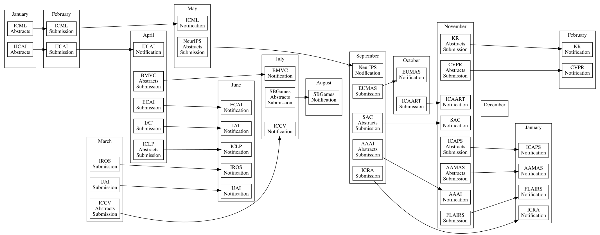

# Rankings

All conferences and journals listed here were classified using either one of these two rankings:
- [Qualis da CAPES](https://sucupira.capes.gov.br)
- [Excellence in Research in Australia (ERA)](http://www.arc.gov.au/excellence-research-australia)

These rakings are summarized in the [Conference Rankings](http://www.conferenceranks.com) and [Qualis@UFMT](http://qualis.ic.ufmt.br) websites

# Journals

Below, I summarize the journals that our work will most likely be a good fit, ranked by the selectiveness and focus.

[JAIR]: http://jair.org "Journal of Artificial Intelligence Research"
[AIJ]: https://www.journals.elsevier.com/artificial-intelligence/ "Artificial Intelligence"
[IS]: https://www.computer.org/intelligent-systems/ "IEEE Intelligent Systems"
[JAAMAS]: http://www.springer.com/computer/ai/journal/10458  "Journal of Autonomous Agents and Multi-Agent Systems"
[KER]: https://www.cambridge.org/core/journals/knowledge-engineering-review "The Knowledge Engineering Review"
[EAAI]: https://www.journals.elsevier.com/engineering-applications-of-artificial-intelligence/ "Engineering Applications of Artificial Intelligence"
[TIST]: http://tist.acm.org "ACM Transactions in Intelligent Systems and Technology"
[TAAS]: http://taas.acm.org "ACM Transactions on Autonomous and Adaptive Systems"
[AILAW]: https://link.springer.com/journal/10506 "Artificial Intelligence and Law"
[AIIM]: https://www.journals.elsevier.com/artificial-intelligence-in-medicine/ "Artificial Intelligence in Medicine"
[YNIMG]: https://www.journals.elsevier.com/neuroimage/ "Neuroimage"
[YNICL]: https://www.journals.elsevier.com/neuroimage-clinical/ "Neuroimage: Clinical"
[JBHI]: https://jbhi.embs.org

### Top Tier Journals
Very selective journals, most of which have very short turnaround times.

- [JAIR] - Journal of Artificial Intelligence Research: 30-60 days turnaround
- [AIJ] - Artificial Intelligence: 30-60 days turnaround
- [IS] - IEEE Intelligent Systems

### Second Tier Journals
Selective journals with a focus on specific types of papers

- [JAAMAS] - Autonomous Agents and Multi-Agent Systems: slow turnaround, focused on agent-related work (the journal counterpart of AAMAS)
- [KER] - The Knowledge Engineering Review: 90 days turnaround, good for surveys and consolidated work
- [TIST] - ACM Transactions in Intelligent Systems and Technology: 90 days turnaround
- [TAAS] - ACM Transactions on Autonomous and Adaptive Systems: 90 days turnaround

### Application Journals
Good journals that accept papers on applications of AI techniques. Empirical results are more of a requirement than theoretical analysis.

- [EAAI] - Engineering Applications of Artificial Intelligence: 90 days turnaround, good for AI applications in broad domains
- [AILAW] - Artificial Intelligence and Law
- [AIIM] - Artificial Intelligence in Medicine
- [YNIMG]- Neuroimage
- [YNICL]- Neuroimage: Clinical
- [JBHI] - IEEE Journal of Biomedical and Health Informatics

# Conference Timeline
**Convert Markdown timeline to Graphviz DOT**



The Ruby program converts parts of the Markdown to Graphviz DOT.
Each ``[]:`` into a link, ``##`` into a cluster, ``-`` of the cluster into a node.
Links and descriptions must be described before the actual input starts.
This README is actually a valid input, see the raw file to see the links.
In order to take full advantage of links and tooltips we recommend SVG output (currently not supported by GitHub Markdown), see the result [here](http://maumagnaguagno.github.io/Timeline).

```Shell
ruby timeline.rb README.md LR                   # Generate Left to Right DOT file
dot README.md.dot -O -T svg # Generate SVG file
```

[IJCAI]: http://www.ijcai.org/ "International Joint Conference on Artificial Intelligence"
[UAI]: http://auai.org/uai2017/index.php "Conference on Uncertainty in Artificial Intelligence"
[IROS]: http://www.iros.org/ "International Conference on Intelligent Robots and Systems"
[ECAI]: http://www.ecai2016.org/ "European Conference on Artificial Intelligence"
[IAT]: http://wibih.unomaha.edu/wi "International Conference on Intelligent Agent Technology"
[SBGames]: http://sbgames.org/ "Simposio Brasileiro de Games e Entretenimento Digital"
[ICRA]: http://www.icra2017.org/ "International Conference on Robotics and Automation"
[SAC]: http://www.sigapp.org/sac/ "Symposium On Applied Computing"
[AAAI]: http://www.aaai.org/Conferences/conferences.php "Association for the Advancement of Artificial Intelligence"
[EUMAS]: http://eumas-at2016.webs.upv.es/EUMAS2016.html "European Conference on Multi-Agent Systems"
[ICAART]: http://www.icaart.org/ "International Conference on Agents and Artificial Intelligence"
[ICAPS]: http://www.icaps-conference.org/ "International Conference on Automated Planning and Scheduling"
[AAMAS]: http://www.ifaamas.org/ "International Conference on Autonomous Agents and Multiagent Systems"
[FLAIRS]: http://www.flairs.com/ "Florida Artificial Intelligence Research Society"
[KR]: http://www.kr.org/ "International Conference on Principles of Knowledge Representation and Reasoning"
[ICLP]: http://software.imdea.org/Conferences/ICLP2016/ "International Conference on Logic Programming"
[NeurIPS]: https://neurips.cc "Conference on Neural Information Processing Systems"
[ICML]: https://icml.cc "Conference on Neural Information Processing Systems"
[ICCV]: https://www.thecvf.com "International Conference on Computer Vision"
[CVPR]: https://www.thecvf.com "Conference on Computer Vision and Pattern Recognition"
[BMVC]: https://bmvc2020-conference.com "British Machine Vision Conference"

## January
- [IJCAI] Abstracts
- [ICML] Abstracts

## February
- [IJCAI] Submission
- [ICML] Submission

## March
- [UAI] Submission
- [IROS] Submission
- [ICCV] Abstracts Submission

## April
- [IJCAI] Notification
- [ECAI] Submission
- [IAT] Submission
- [ICLP] Abstracts Submission
- [BMVC] Abstracts Submission

## May

- [NeurIPS] Abstracts Submission
- [ICML] Notification

## June
- [ECAI] Notification
- [IAT] Notification
- [UAI] Notification
- [IROS] Notification
- [ICLP] Notification
- [AIIDE] Submission

## July
- [SBGames] Abstracts Submission
- [ICCV] Notification
- [BMVC] Notification

## August
- [SBGames] Notification

## September
- [ICRA] Submission
- [SAC] Abstracts Submission
- [AAAI] Abstracts Submission
- [EUMAS] Submission
- [NeurIPS] Notification

## October
- [EUMAS] Notification
- [ICAART] Submission

## November
- [AAAI] Notification
- [SAC] Notification
- [ICAPS] Abstracts Submission
- [AAMAS] Abstracts Submission
- [KR] Abstracts Submission
- [FLAIRS] Submission
- [ICAART] Notification
- [CVPR] Abstracts Submission

## December

## January
- [ICRA] Notification
- [ICAPS] Notification
- [AAMAS] Notification
- [FLAIRS] Notification

## February
- [KR] Notification
- [CVPR] Notification
